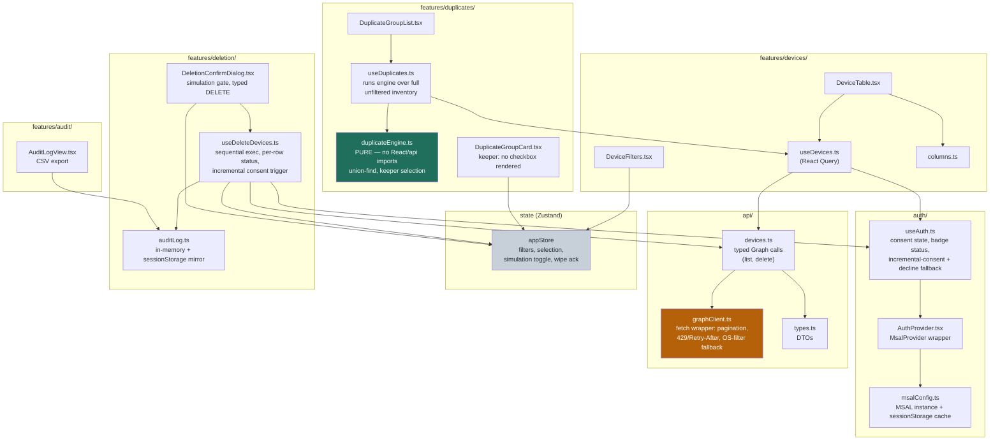

# Component View (C4 Level 3 — inside the SPA container)

## Components and Responsibilities

| Component | Responsibility | Constraint satisfied | ADR |
|---|---|---|---|
| `auth/msalConfig.ts` | MSAL instance config, `sessionStorage` cache location | C-2 | ADR-002 |
| `auth/useAuth.ts` | Consent-state exposure (header badge), silent-refresh-then-interactive, incremental consent + decline fallback | Q-4, Q-5, C-2 | ADR-002, ADR-006 |
| `api/graphClient.ts` | Pagination via `nextLink`, 429/`Retry-After` wait, OS-filter try-then-fallback with path reporting | C-4, C-5, Q-3 | ADR-003 |
| `api/devices.ts` | Typed list/delete calls over `graphClient` | C-1 | ADR-001, ADR-003 |
| `store/appStore.ts` (Zustand) | Filters, selection, simulation toggle, wipe-ack — with **no-op guards** on invalid transitions (locked row, keeper row, unconfirmed delete) | C-7, C-8, C-9 | ADR-004 |
| `features/duplicates/duplicateEngine.ts` | Pure union-find grouping, identifier normalization/validation, keeper selection, warnings — zero React/api imports | C-6 | (no ADR — direct spec transcription, no tradeoff) |
| `features/duplicates/useDuplicates.ts` | Runs the engine against the **complete unfiltered** inventory regardless of current table filters (spec §9.2: "filtering the view must never change which records are considered part of a duplicate group") | spec §9.2 | — |
| `features/duplicates/DuplicateGroupCard.tsx` | Renders keeper (no `Checkbox` in the render tree, not just disabled) and candidates; surfaces `matchedOn` and warnings | C-8 | ADR-004 |
| `features/deletion/useDeleteDevices.ts` | Sequential per-row execution with live status; triggers incremental consent; on decline, invokes ADR-006 fallback | C-10, Q-1 | ADR-006 |
| `features/deletion/DeletionConfirmDialog.tsx` | Simulation gate, typed "DELETE" requirement, consequence-split messaging ("12 retire, 3 factory reset") | C-7, spec §8 | ADR-006 |
| `features/deletion/auditLog.ts` | Append-only log, `sessionStorage` mirror + rehydrate on load | Q-2 | ADR-005 |
| `features/audit/AuditLogView.tsx` | Session log display + CSV export | Q-2 | ADR-005 |

## Sources

- `/home/shadow007/dev/IT-Together/duplicate-device-cleanup/docs/architecture/02-analysis/structural-views/container.md` — enclosing container view
- `/home/shadow007/dev/IT-Together/duplicate-device-cleanup/docs/architecture/02-analysis/architecture-decisions/` — ADR-001 through ADR-006, each linked above per component
- `/home/shadow007/dev/IT-Together/duplicate-device-cleanup/docs/architecture/02-analysis/constraints-and-context.md` — constraint IDs (C-1..C-12) referenced above
- `/home/shadow007/dev/IT-Together/duplicate-device-cleanup/docs/architecture/03-dossiers/code-level-detail.md` — file tree, function signatures, fixture data for `duplicateEngine.ts`
